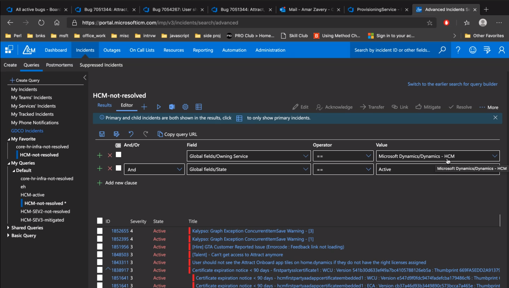

# Troubleshoot using Kusto

Kusto Extra MetaData is stored in property bag
CustomDimentions, ClientEvents, CustomEvent and TraceEvent

```sql
ClientEvents
| where Timestamp > todatetime("2019-04-01 20:31:02Z") and Timestamp < todatetime("2019-04-01 20:51:02Z")
| where Name == "GenericErrorDialog"
| extend cd = parsejson(CustomDimentions) 
| where cd.errorCode contains "GenericGetCompanyInfo" or cd.errorMessage contains "Undefined"
| where cd.rootActivity == ""
```

```sql
TraceEvent
| where ActivityType contains "HcmAttEOL"
```

```sql
ClientEvents
| where RootActivityId == "" 
// If there is no output then we can get it from TraceEvent
```

```sql
TraceEvent
| where RootActivityId = ""
```

```sql
TraceEvent
| where SessionId == ""
| project TIMESTAMP, RootActivityId, ActivityType, ActivityVector, TraceLevel, TraceMessage
```

ActivityVector provide the sequence of execution for Async calls so it's helpful on building the call stack during investigation

::: tip
:bulb: Notes
* Leverage TraceEvent not just ClientEvents using raid/session id etc
* Leverage activity vector, activity type, application, service
* Use custom dimensions when needed
* Use status app for environment details, tenant details, user information
* Use tsg/wiki - all possible exception are there so search for it
* xrm exceptions - there is an amazing wiki - use that (xrm is on top of CDS)
* Play with product to understand how something should work
* Big picture - don't focus on just one issue what is reported - offer example
* repro - last thing to do 
:::

::: tip Apps
* Go1Adapter.sln
* XRMSolutions.sln
* TalentEngagementServiceApp.sln (Attract Service)
* SchedulingServiceApp.sln (Schedular for scheduling interviews and stuff)
* OfferManagementService.sln
* JobPostingServiceApp.sln
* OnboardingServiceApp.sln
* ProvisioningServiceApp.sln
* FlightingServiceApp.sln
All services are in D365
:::

## Onboarding
* https://dynamics.wiki/index.php/HCM_Engineering
* https://dynamics.wiki/index.php/Security_Groups_and_memberships#XRM_environments
* https://msazure.visualstudio.com/D365

## Resources/links
* https://attract.talent.dev.dynamics.com
* https://dataexplorer.azure.com/* 
* https://kusto.azurewebsites.net/docs/

## Apps
[Onboard](https://onboard.talent.dev.dynamics.com/dashboard)
[Offer](https://offer.talent.dev.dynamics.com/offers)
[Attract](https://attract.talent.dev.dynamics.com/environments)

## Tools
[Repo](https://msazure.visualstudio.com/d365)
[Data Explorer web](https://dataexplorer.azure.com/clusters/dynamicshcmint/databases/HCMServicesLogsINT)

## Kusto Environments
Connection: https://dynamicshcmint.kusto.windows.net
Connection: https://dynamicshcmint.kusto.windows.net

## Documents
* [Dynamics365HCM]( https://microsoft.sharepoint.com/teams/Dynamics365HCM/Shared%20Documents/Forms/AllItems.aspx)
* [HCM Arch](https://microsoft.sharepoint.com/:u:/r/teams/Dynamics365HCM/_layouts/15/Doc.aspx?sourcedoc=%7B20405A97-6756-437A-9544-F81E096386C5%7D&file=HCM_Arch.vsdx&action=default)

## TODO
* Service Fabric and service app

## Kusto Environment


## ICM Query
[ICM link](https://aka.ms/ICM)


## Attract


