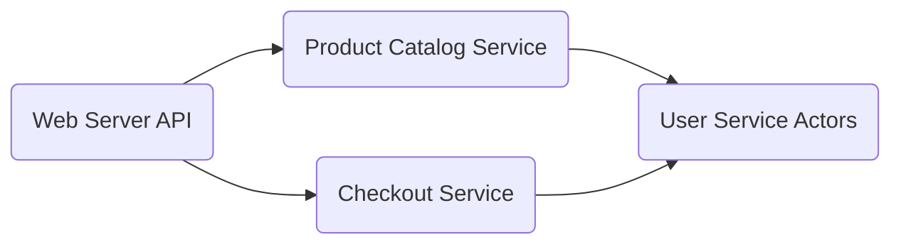
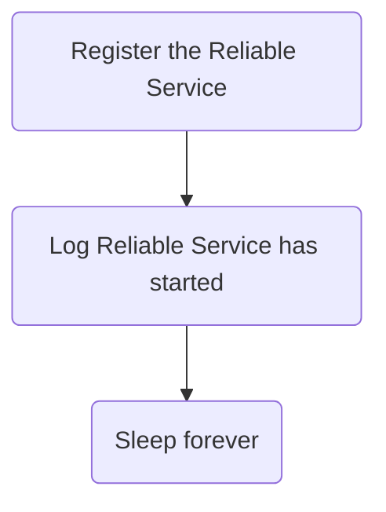
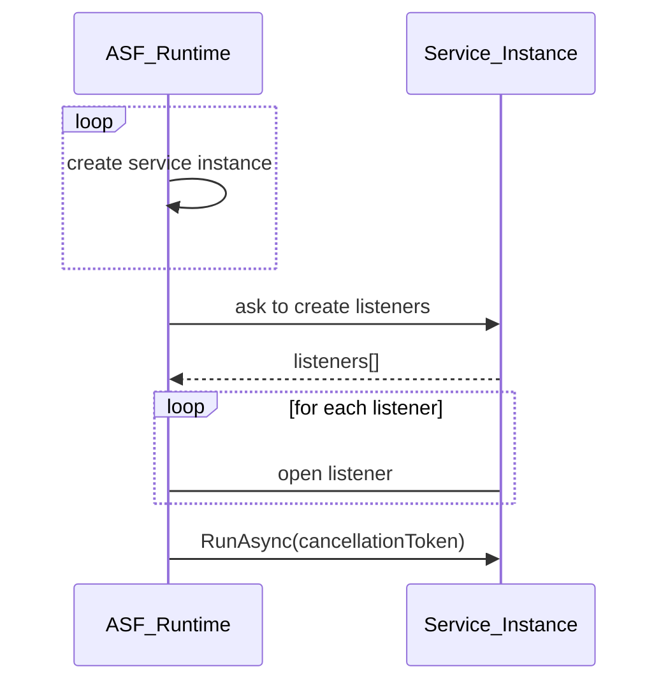
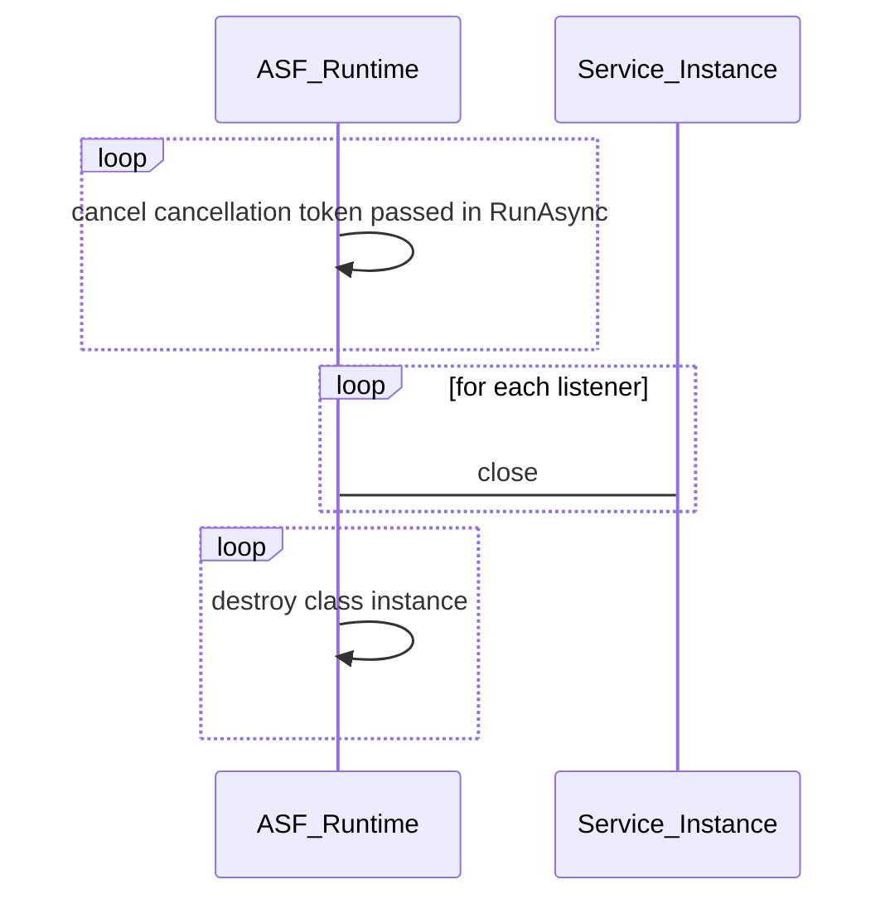
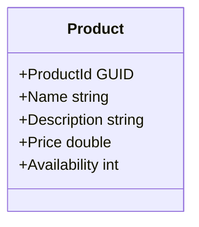
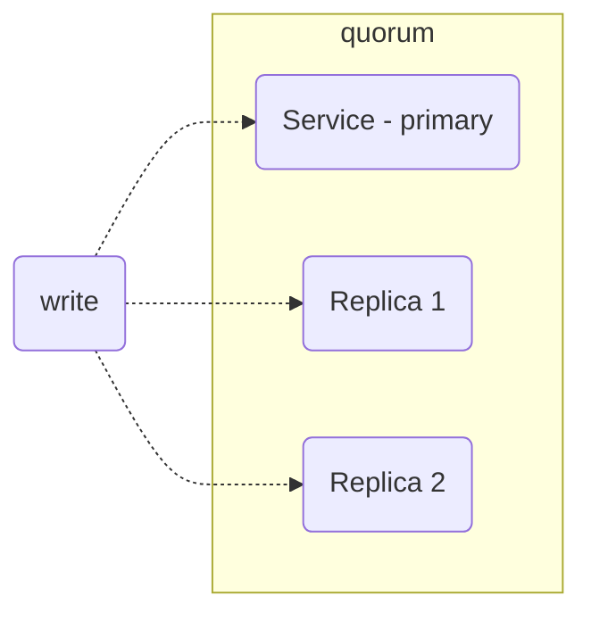

# Starting Azure Service Fabric

## Options for building Microservices in Azure:
* Azure Kubernetes Service - Container Orchestrator
* Azure Service Fabric - Microservice framework and orchestrator that solves many of problems
  * Service Communication
  * Service discovery
  * Telemetry
  * Provision and upgrade
  * Testing locally
  * Manage downtimes
  * Scaling in and out
* Azure Functions

## Programming Models provided by Service Fabric
* Reliable services
  * stateless (similar to console app)
  * stateful
* Reliable actors - Virtual actor design pattern built on top of stateful reliable services framework to handle massive amount of client request with enormous computing power
* Guest executables - Wrap any existing application to run on Service Fabric
* Containers


## Installing Service Fabric
Service Fabric is best in cloud environment but can be installed in On Premise as well as in Developer workstation and the is no difference the underlying Service Fabric.

**OneBox** - Azure Service Fabric Cluster that can be deployed to a single dev machine.

::: tip
Tools:
* Visual Studio 2019 (Community Version would work as well)
* Service Fabric tooling (it's a part of Visual studio components)
* Service Fabric SDK (can be installed as isolated package or use Web Platform Installer)
:::

## Creating Service Fabric Services
Let's create application with these services
We will create services
* Web Server (API) - It's a stateless service and only act as a facade.
* Product Catalog - It's a stateful service. 



Both of these services are reliable services as they runs in the background. Reliable service has access to ASF API which is all about microservies, scaling, health report and many more. It has various communication model as http, ftp, websocket etc. It's all about low latency and high speed. It also has access to reliable storage. All these features comes with simple programming model.

### Creating Service Application
When we create a new service 

```csharp
using System;
using System.Diagnostics;
using System.Threading;
using System.Threading.Tasks;
using Microsoft.ServiceFabric.Services.Runtime;

namespace ECommerce.ProductCatalog
{
    internal static class Program
    {
        /// <summary>
        /// This is the entry point of the service host process.
        /// </summary>
        private static void Main()
        {
            try
            {
                // The ServiceManifest.XML file defines one or more service type names.
                // Registering a service maps a service type name to a .NET type.
                // When Service Fabric creates an instance of this service type,
                // an instance of the class is created in this host process.

                ServiceRuntime.RegisterServiceAsync("ECommerce.ProductCatalogType",
                    context => new ProductCatalog(context)).GetAwaiter().GetResult();

                ServiceEventSource.Current.ServiceTypeRegistered(Process.GetCurrentProcess().Id, typeof(ProductCatalog).Name);

                // Prevents this host process from terminating so services keep running.
                Thread.Sleep(Timeout.Infinite);
            }
            catch (Exception e)
            {
                ServiceEventSource.Current.ServiceHostInitializationFailed(e.ToString());
                throw;
            }
        }
    }
}
```
Let's checkout what happens in the code


There is another class get create which ASF creates the instance during run time and this is the entry point for the service.
```csharp
using System;
using System.Collections.Generic;
using System.Fabric;
using System.Linq;
using System.Threading;
using System.Threading.Tasks;
using Microsoft.ServiceFabric.Data.Collections;
using Microsoft.ServiceFabric.Services.Communication.Runtime;
using Microsoft.ServiceFabric.Services.Runtime;

namespace ECommerce.ProductCatalog
{
    /// <summary>
    /// An instance of this class is created for each service replica by the Service Fabric runtime.
    /// </summary>
    internal sealed class ProductCatalog : StatefulService
    {
        public ProductCatalog(StatefulServiceContext context)
            : base(context)
        { }

        /// <summary>
        /// Optional override to create listeners (e.g., HTTP, Service Remoting, WCF, etc.) for this service replica to handle client or user requests.
        /// </summary>
        /// <remarks>
        /// For more information on service communication, see https://aka.ms/servicefabricservicecommunication
        /// </remarks>
        /// <returns>A collection of listeners.</returns>
        protected override IEnumerable<ServiceReplicaListener> CreateServiceReplicaListeners()
        {
            return new ServiceReplicaListener[0];
        }

        /// <summary>
        /// This is the main entry point for your service replica.
        /// This method executes when this replica of your service becomes primary and has write status.
        /// </summary>
        /// <param name="cancellationToken">Canceled when Service Fabric needs to shut down this service replica.</param>
        protected override async Task RunAsync(CancellationToken cancellationToken)
        {
            // TODO: Replace the following sample code with your own logic 
            //       or remove this RunAsync override if it's not needed in your service.

            var myDictionary = await this.StateManager.GetOrAddAsync<IReliableDictionary<string, long>>("myDictionary");

            while (true)
            {
                cancellationToken.ThrowIfCancellationRequested();

                using (var tx = this.StateManager.CreateTransaction())
                {
                    var result = await myDictionary.TryGetValueAsync(tx, "Counter");

                    ServiceEventSource.Current.ServiceMessage(this.Context, "Current Counter Value: {0}",
                        result.HasValue ? result.Value.ToString() : "Value does not exist.");

                    await myDictionary.AddOrUpdateAsync(tx, "Counter", 0, (key, value) => ++value);

                    // If an exception is thrown before calling CommitAsync, the transaction aborts, all changes are 
                    // discarded, and nothing is saved to the secondary replicas.
                    await tx.CommitAsync();
                }

                await Task.Delay(TimeSpan.FromSeconds(1), cancellationToken);
            }
        }
    }
}


```

### Service Lifecycle
**Startup**


**Shutdown**


:::tip
It's very important to **always respond to cancellationToken event as soon as possible** if we run RunAsync all the time in the background
:::

### Creating Product Catalog Service
**Product Entity**


**Service Fabric State**
The minimum set of replica to achieve data consistency is called quorum. The size is usually 3 nodes. Service state consist of local storage to save persist state therefore is very fast.


## Exploring Actor Model Support

## Managing State

## Getting Ready for Deployment


