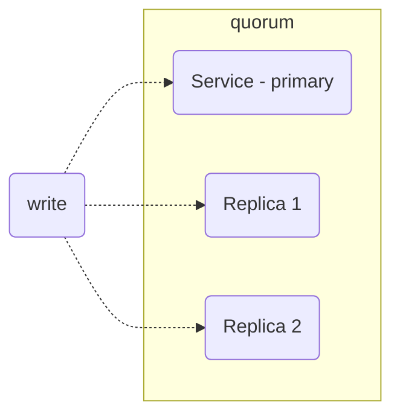
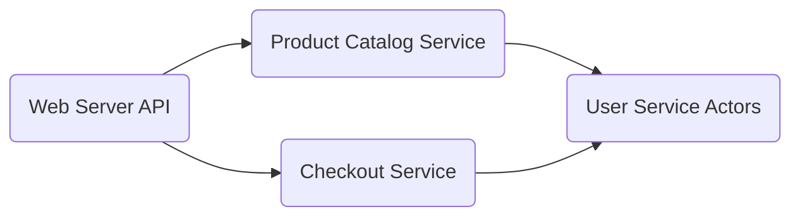
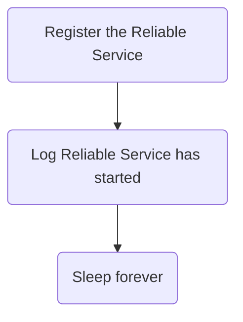
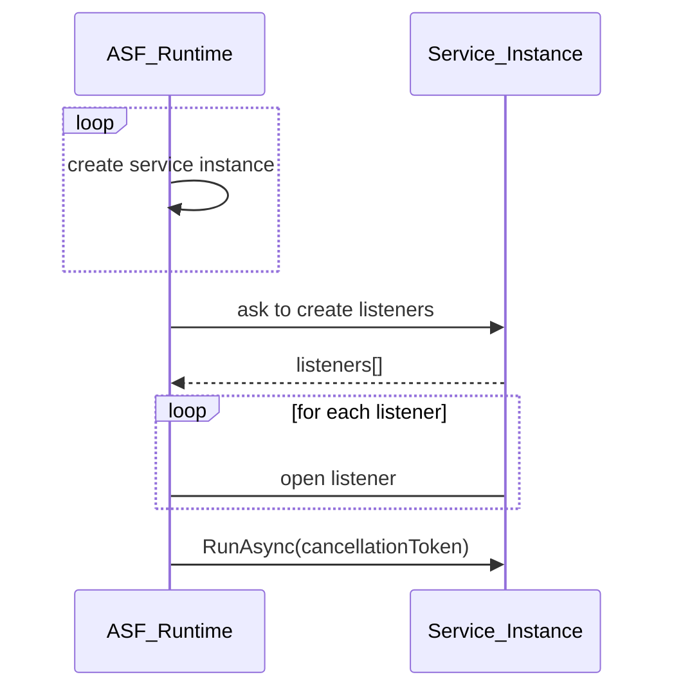
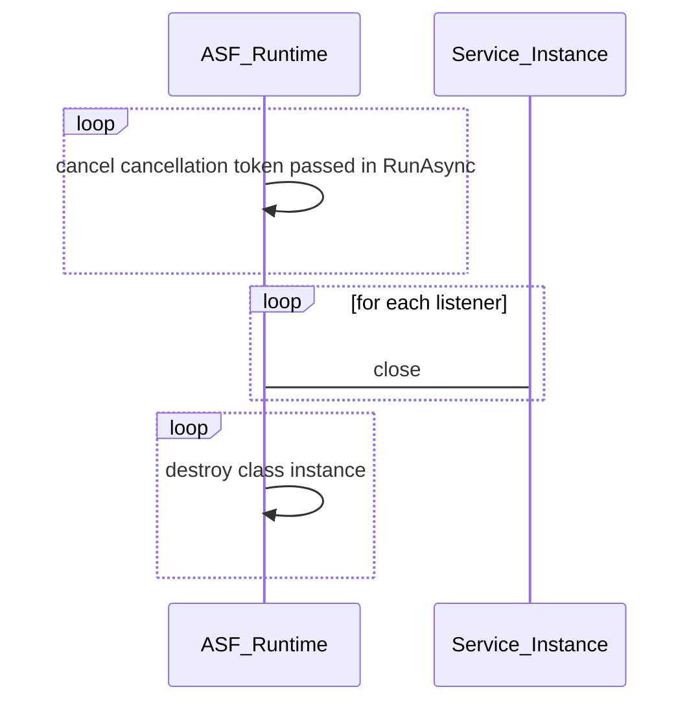
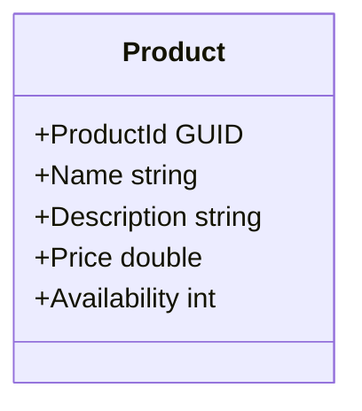
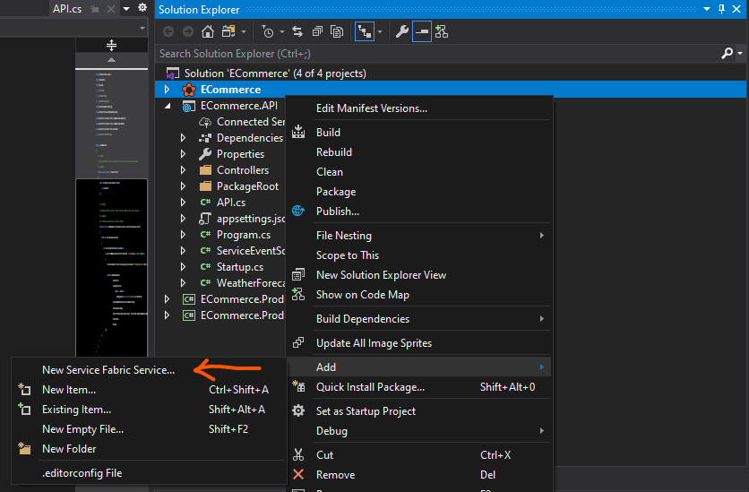
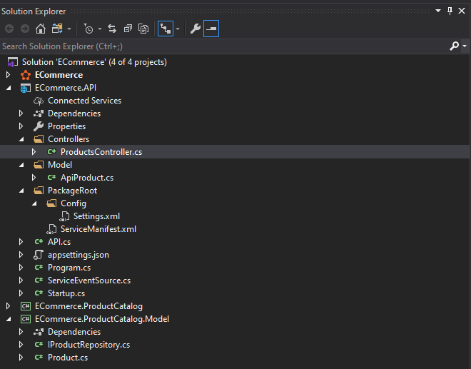
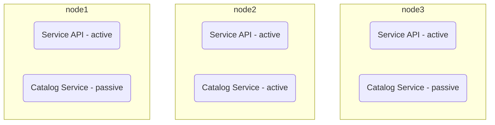
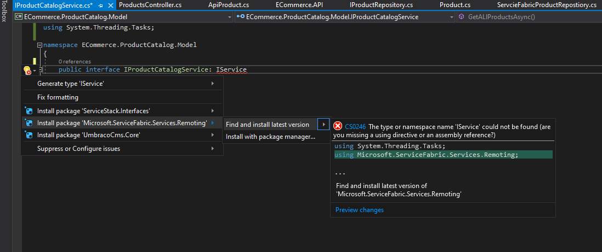

# Starting Azure Service Fabric

## Options for building Microservices in Azure:
* Azure Kubernetes Service - Container Orchestrator
* Azure Service Fabric - Microservice framework and orchestrator that solves many of problems
  * Service Communication
  * Service discovery
  * Telemetry
  * Provision and upgrade
  * Testing locally
  * Manage downtimes
  * Scaling in and out
* Azure Functions

## Programming Models provided by Service Fabric
* Reliable services
  * stateless (similar to console app)
  * stateful
* Reliable actors - Virtual actor design pattern built on top of stateful reliable services framework to handle massive amount of client request with enormous computing power
* Guest executables - Wrap any existing application to run on Service Fabric
* Containers


## Installing Service Fabric
Service Fabric is best in cloud environment but can be installed in On Premise as well as in Developer workstation and the is no difference the underlying Service Fabric.

**OneBox** - Azure Service Fabric Cluster that can be deployed to a single dev machine.

::: tip
Tools:
* Visual Studio 2019 (Community Version would work as well)
* Service Fabric tooling (it's a part of Visual studio components)
* Service Fabric SDK (can be installed as isolated package or use Web Platform Installer)
:::

## Creating Service Fabric Services
### **Service Fabric State**
The minimum set of replica to achieve data consistency is called quorum. The size is usually 3 nodes. Service state consist of local storage to save persist state therefore is very fast.


Let's create application with these services
We will create services
* Web Server (API) - It's a stateless service and only act as a facade.
* Product Catalog - It's a stateful service. 



Both of these services are reliable services as they runs in the background. Reliable service has access to ASF API which is all about microservies, scaling, health report and many more. It has various communication model as http, ftp, websocket etc. It's all about low latency and high speed. It also has access to reliable storage. All these features comes with simple programming model.

### Creating Service Application
When we create a new service 

```csharp
using System;
using System.Diagnostics;
using System.Threading;
using System.Threading.Tasks;
using Microsoft.ServiceFabric.Services.Runtime;

namespace ECommerce.ProductCatalog
{
    internal static class Program
    {
        /// <summary>
        /// This is the entry point of the service host process.
        /// </summary>
        private static void Main()
        {
            try
            {
                // The ServiceManifest.XML file defines one or more service type names.
                // Registering a service maps a service type name to a .NET type.
                // When Service Fabric creates an instance of this service type,
                // an instance of the class is created in this host process.

                ServiceRuntime.RegisterServiceAsync("ECommerce.ProductCatalogType",
                    context => new ProductCatalog(context)).GetAwaiter().GetResult();

                ServiceEventSource.Current.ServiceTypeRegistered(Process.GetCurrentProcess().Id, typeof(ProductCatalog).Name);

                // Prevents this host process from terminating so services keep running.
                Thread.Sleep(Timeout.Infinite);
            }
            catch (Exception e)
            {
                ServiceEventSource.Current.ServiceHostInitializationFailed(e.ToString());
                throw;
            }
        }
    }
}
```
Let's checkout what happens in the code


There is another class get create which ASF creates the instance during run time and this is the entry point for the service.
**ProductCatalog.cs**
```csharp
using System;
using System.Collections.Generic;
using System.Fabric;
using System.Linq;
using System.Threading;
using System.Threading.Tasks;
using Microsoft.ServiceFabric.Data.Collections;
using Microsoft.ServiceFabric.Services.Communication.Runtime;
using Microsoft.ServiceFabric.Services.Runtime;

namespace ECommerce.ProductCatalog
{
    /// <summary>
    /// An instance of this class is created for each service replica by the Service Fabric runtime.
    /// </summary>
    internal sealed class ProductCatalog : StatefulService
    {
        public ProductCatalog(StatefulServiceContext context)
            : base(context)
        { }

        /// <summary>
        /// Optional override to create listeners (e.g., HTTP, Service Remoting, WCF, etc.) for this service replica to handle client or user requests.
        /// </summary>
        /// <remarks>
        /// For more information on service communication, see https://aka.ms/servicefabricservicecommunication
        /// </remarks>
        /// <returns>A collection of listeners.</returns>
        protected override IEnumerable<ServiceReplicaListener> CreateServiceReplicaListeners()
        {
            return new ServiceReplicaListener[0];
        }

        /// <summary>
        /// This is the main entry point for your service replica.
        /// This method executes when this replica of your service becomes primary and has write status.
        /// </summary>
        /// <param name="cancellationToken">Canceled when Service Fabric needs to shut down this service replica.</param>
        protected override async Task RunAsync(CancellationToken cancellationToken)
        {
            // TODO: Replace the following sample code with your own logic 
            //       or remove this RunAsync override if it's not needed in your service.

            var myDictionary = await this.StateManager.GetOrAddAsync<IReliableDictionary<string, long>>("myDictionary");

            while (true)
            {
                cancellationToken.ThrowIfCancellationRequested();

                using (var tx = this.StateManager.CreateTransaction())
                {
                    var result = await myDictionary.TryGetValueAsync(tx, "Counter");

                    ServiceEventSource.Current.ServiceMessage(this.Context, "Current Counter Value: {0}",
                        result.HasValue ? result.Value.ToString() : "Value does not exist.");

                    await myDictionary.AddOrUpdateAsync(tx, "Counter", 0, (key, value) => ++value);

                    // If an exception is thrown before calling CommitAsync, the transaction aborts, all changes are 
                    // discarded, and nothing is saved to the secondary replicas.
                    await tx.CommitAsync();
                }

                await Task.Delay(TimeSpan.FromSeconds(1), cancellationToken);
            }
        }
    }
}


```

### Service Lifecycle
**Startup**


**Shutdown**


:::tip
It's very important to **always respond to cancellationToken event as soon as possible** if we run RunAsync all the time in the background
:::

### Creating Product Catalog Service
**Product Entity**


Now lets add IProuductRepostory and Product in library project and reference it from ProductCatalog Service project.
**IProductRepository**
```csharp
using System;
using System.Collections.Generic;
using System.Text;
using System.Threading.Tasks;

namespace ECommerce.ProductCatalog.Model
{
    public interface IProductRepository
    {
        Task<IEnumerable<Product>> GetProducts();
        Task AddProudct(Product product);
    }
}
```

**Product**
```csharp
using System;

namespace ECommerce.ProductCatalog.Model
{
    public class Product
    {
        public Guid Id { get; set; }
        public string Name { get; set; }
        public string Description { get; set; }
        public double Price { get; set; }
        public int Availability { get; set; }
    }
}
```

Let's create ServiceFabricProductRepository nad update ProductCatalog in ProductCatalog project.
**ServiceFabricProductRepository**
```csharp
using System;
using System.Collections.Generic;
using System.Text;
using System.Threading;
using System.Threading.Tasks;
using ECommerce.ProductCatalog.Model;
using Microsoft.ServiceFabric.Data;
using Microsoft.ServiceFabric.Data.Collections;

namespace ECommerce.ProductCatalog
{
    class ServcieFabricProductRepostiory : IProductRepository
    {
        private readonly IReliableStateManager _stateManager;

        public ServcieFabricProductRepostiory(IReliableStateManager stateManager)
        {
            _stateManager = stateManager;
        }

        public async Task AddProudct(Product product)
        {
            var products = await _stateManager.GetOrAddAsync<IReliableDictionary<Guid, Product>>("product");

            using (ITransaction tx = _stateManager.CreateTransaction())
            {
                await products.AddOrUpdateAsync(tx, product.Id, product, (id, value) => product);

                await tx.CommitAsync();
            }
        }

        public async Task<IEnumerable<Product>> GetProducts()
        {
            var products = await _stateManager.GetOrAddAsync<IReliableDictionary<Guid, Product>>("product");
            var result = new List<Product>();

            using (ITransaction tx = _stateManager.CreateTransaction())
            {
                var allProducts = await products.CreateEnumerableAsync(tx, EnumerationMode.Unordered);

                using (var enumerator = allProducts.GetAsyncEnumerator())
                {
                    while (await enumerator.MoveNextAsync(CancellationToken.None))
                    {
                        result.Add(enumerator.Current.Value);
                    }
                }
            }

            return result;
        }
    }
}
```

**ProductCatalog**
```csharp
using System;
using System.Collections.Generic;
using System.Fabric;
using System.Linq;
using System.Threading;
using System.Threading.Tasks;
using ECommerce.ProductCatalog.Model;
using Microsoft.ServiceFabric.Data.Collections;
using Microsoft.ServiceFabric.Services.Communication.Runtime;
using Microsoft.ServiceFabric.Services.Runtime;

namespace ECommerce.ProductCatalog
{
    /// <summary>
    /// An instance of this class is created for each service replica by the Service Fabric runtime.
    /// </summary>
    internal sealed class ProductCatalog : StatefulService
    {
        private ServcieFabricProductRepostiory _repo;
        public ProductCatalog(StatefulServiceContext context)
            : base(context)
        { }

        /// <summary>
        /// Optional override to create listeners (e.g., HTTP, Service Remoting, WCF, etc.) for this service replica to handle client or user requests.
        /// </summary>
        /// <remarks>
        /// For more information on service communication, see https://aka.ms/servicefabricservicecommunication
        /// </remarks>
        /// <returns>A collection of listeners.</returns>
        protected override IEnumerable<ServiceReplicaListener> CreateServiceReplicaListeners()
        {
            return new ServiceReplicaListener[0];
        }

        /// <summary>
        /// This is the main entry point for your service replica.
        /// This method executes when this replica of your service becomes primary and has write status.
        /// </summary>
        /// <param name="cancellationToken">Canceled when Service Fabric needs to shut down this service replica.</param>
        protected override async Task RunAsync(CancellationToken cancellationToken)
        {
            var product1 = new Product
            {
                Id = Guid.NewGuid(),
                Name = "Dell Monitor",
                Description = " Computer Monitor",
                Price = 500,
                Availability = 100
            };

            var product2 = new Product
            {
                Id = Guid.NewGuid(),
                Name = "Keyboard",
                Description = " Computer Accesories",
                Price = 510,
                Availability = 110
            };

            var product3 = new Product
            {
                Id = Guid.NewGuid(),
                Name = "Mouse",
                Description = " Computer Accesories",
                Price = 520,
                Availability = 120
            };

            _repo = new ServcieFabricProductRepostiory(this.StateManager);

            await _repo.AddProudct(product1);
            await _repo.AddProudct(product2);
            await _repo.AddProudct(product3);

            var all = await _repo.GetProducts();
        }
    }
}
```
At this point we should be able to run the application and check there are 3 products in all variable which is await of GetProducts()

This is how the solution should look like:


:::warning
Visual Studio need to run in elevated mode as Admin to allow access network level resources
:::

### Creating a Web API
To add new Stateless ASP .net Core Web API, right click on ECommerce project and add New Service Fabric Service and choose, stateless asp.net core API.


Program.cs is console application very similar to previous one which resisters the service type.

API
```csharp{30}
using System.Collections.Generic;
using System.Fabric;
using System.IO;
using Microsoft.AspNetCore.Hosting;
using Microsoft.Extensions.DependencyInjection;
using Microsoft.ServiceFabric.Services.Communication.AspNetCore;
using Microsoft.ServiceFabric.Services.Communication.Runtime;
using Microsoft.ServiceFabric.Services.Runtime;

namespace ECommerce.API
{
    /// <summary>
    /// The FabricRuntime creates an instance of this class for each service type instance. 
    /// </summary>
    internal sealed class API : StatelessService
    {
        public API(StatelessServiceContext context)
            : base(context)
        { }

        /// <summary>
        /// Optional override to create listeners (like tcp, http) for this service instance.
        /// </summary>
        /// <returns>The collection of listeners.</returns>
        protected override IEnumerable<ServiceInstanceListener> CreateServiceInstanceListeners()
        {
            return new ServiceInstanceListener[]
            {
                new ServiceInstanceListener(serviceContext =>
                    new KestrelCommunicationListener(serviceContext, "ServiceEndpoint", (url, listener) =>
                    {
                        ServiceEventSource.Current.ServiceMessage(serviceContext, $"Starting Kestrel on {url}");

                        return new WebHostBuilder()
                                    .UseKestrel()
                                    .ConfigureServices(
                                        services => services
                                            .AddSingleton<StatelessServiceContext>(serviceContext))
                                    .UseContentRoot(Directory.GetCurrentDirectory())
                                    .UseStartup<Startup>()
                                    .UseServiceFabricIntegration(listener, ServiceFabricIntegrationOptions.None)
                                    .UseUrls(url)
                                    .Build();
                    }))
            };
        }
    }
}
```
**KestrelCommunicationListener** is standard fabric listener which bootstrap asp.net core runtime and configure it to run inside service fabric environment.

Let's add Product Api Model
```csharp
using System;
using Newtonsoft.Json;

namespace ECommerce.API.Model
{
    public class ApiProduct
    {
        [JsonProperty("id")]
        public Guid Id { get; set; }
        [JsonProperty("name")]
        public string Name { get; set; }
        [JsonProperty("description")]
        public string Description { get; set; }
        [JsonProperty("price")]
        public double Price { get; set; }
        [JsonProperty("isAvailable")]
        public int IsAvailable { get; set; }
    }
}
```

Here is new project structure:


### Communicating between two services
Let's say there are 3 node cluster

Since API are stateless they are active in all nodes but Catalog Service is stateful so Service Fabric makes one active and other two passive in case of fail over.

:::tip
Never assume a service is running in a fixed location. Services in Service Fabric can move around and change roles all the time during the lifetime of the application and even between requests. Therefore, before making the request we should always query the service location from Service Fabric runtime.
:::

Service Fabric is protocol agnostic. Out of the box there are three protocols:
* WCF
* HTTP
* Service Remoting (Default protocol for reliable communication)

Benefits of using Service Remoting:
* Automatic service address resolution
* Establishing connection
* Retries
* Error handling
* Strong typed
* Fast

For the purpose of remoting we are adding Service interface in the Model
**IProductCatalogService**
```csharp
using System.Threading.Tasks;
using Microsoft.ServiceFabric.Services.Remoting;

namespace ECommerce.ProductCatalog.Model
{
    public interface IProductCatalogService: IService
    {
        Task<Product[]> GetALlProductsAsync();
        Task AddProductAsync(Product product);
    }
}
```
We need to install the remoting service library.


And implement IProductCatalogService in ProductCatalog
```csharp{24-32,43-46}
using System;
using System.Collections.Generic;
using System.Fabric;
using System.Linq;
using System.Threading;
using System.Threading.Tasks;
using ECommerce.ProductCatalog.Model;
using Microsoft.ServiceFabric.Services.Communication.Runtime;
using Microsoft.ServiceFabric.Services.Remoting.V2.FabricTransport.Runtime;
using Microsoft.ServiceFabric.Services.Runtime;

namespace ECommerce.ProductCatalog
{
    /// <summary>
    /// An instance of this class is created for each service replica by the Service Fabric runtime.
    /// </summary>
    internal sealed class ProductCatalog : StatefulService, IProductCatalogService
    {
        private ServiceFabricProductRepository _repo;
        public ProductCatalog(StatefulServiceContext context)
            : base(context)
        { }

        public async Task AddProductAsync(Product product)
        {
            await _repo.AddProduct(product);
        }

        public async Task<Product[]> GetALlProductsAsync()
        {
            return (await _repo.GetProducts()).ToArray();
        }

        /// <summary>
        /// Optional override to create listeners (e.g., HTTP, Service Remoting, WCF, etc.) for this service replica to handle client or user requests.
        /// </summary>
        /// <remarks>
        /// For more information on service communication, see https://aka.ms/servicefabricservicecommunication
        /// </remarks>
        /// <returns>A collection of listeners.</returns>
        protected override IEnumerable<ServiceReplicaListener> CreateServiceReplicaListeners()
        {
            return new[]
            {
                new ServiceReplicaListener(context => new FabricTransportServiceRemotingListener(context, this))
            };
        }

        /// <summary>
        /// This is the main entry point for your service replica.
        /// This method executes when this replica of your service becomes primary and has write status.
        /// </summary>
        /// <param name="cancellationToken">Canceled when Service Fabric needs to shut down this service replica.</param>
        protected override async Task RunAsync(CancellationToken cancellationToken)
        {
            var product1 = new Product
            {
                Id = Guid.NewGuid(),
                Name = "Dell Monitor",
                Description = " Computer Monitor",
                Price = 500,
                Availability = 100
            };

            var product2 = new Product
            {
                Id = Guid.NewGuid(),
                Name = "Keyboard",
                Description = " Computer Accessories",
                Price = 510,
                Availability = 110
            };

            var product3 = new Product
            {
                Id = Guid.NewGuid(),
                Name = "Mouse",
                Description = " Computer Accessories",
                Price = 520,
                Availability = 120
            };

            _repo = new ServiceFabricProductRepository(this.StateManager);

            await _repo.AddProduct(product1);
            await _repo.AddProduct(product2);
            await _repo.AddProduct(product3);

            var all = await _repo.GetProducts();
        }
    }
}
```

:::tip
The return type must be array as the service remoting doesn't understand IEnumerable and it needs to transform over the networks it should be simple type.
:::

Finally it's time to add proxy in API to connect to ProductCatalogService.
**ProductController**
```csharp{20-28,33-42,48-57}
using System;
using System.Collections.Generic;
using System.Linq;
using System.Threading.Tasks;
using ECommerce.API.Model;
using ECommerce.ProductCatalog.Model;
using Microsoft.AspNetCore.Mvc;
using Microsoft.ServiceFabric.Services.Client;
using Microsoft.ServiceFabric.Services.Remoting.Client;
using Microsoft.ServiceFabric.Services.Remoting.V2.FabricTransport.Client;

namespace ECommerce.API.Controllers
{
    [ApiController]
    [Route("[controller]")]
    public class ProductsController : ControllerBase
    {
        private readonly IProductCatalogService _service;

        public ProductsController()
        {
            var proxyFactory = new ServiceProxyFactory(
                c => new FabricTransportServiceRemotingClientFactory());

            _service = proxyFactory.CreateServiceProxy<IProductCatalogService>(
                new Uri("fabric:/ECommerce/ECommerce.ProductCatalog"),
                new ServicePartitionKey(0));
        }

        [HttpGet]
        public async Task<IEnumerable<ApiProduct>> GetAsync()
        {
            var allProducts = await _service.GetAllProductsAsync();

            return allProducts.Select(p => new ApiProduct
            {
                Id = p.Id,
                Name = p.Name,
                Description = p.Description,
                Price = p.Price,
                IsAvailable = p.Availability > 0
            });
        }

        [HttpPost]
        public async Task PostAsync([FromBody] ApiProduct product)
        {
            var newProduct = new Product()
            {
                Id = Guid.NewGuid(),
                Name = product.Name,
                Description = product.Description,
                Price = product.Price,
                Availability = 100
            };

            await _service.AddProductAsync(newProduct);
        }      
    }
}
```
Lunch the application and test it with Postman for both get and post.

:::tip
URI Format for proxy:
fabric/ApplicationName/ServiceName
Eg: fabric:/ECommerce/ProductCatalog
:::

## Exploring Actor Model Support

## Managing State

## Getting Ready for Deployment


